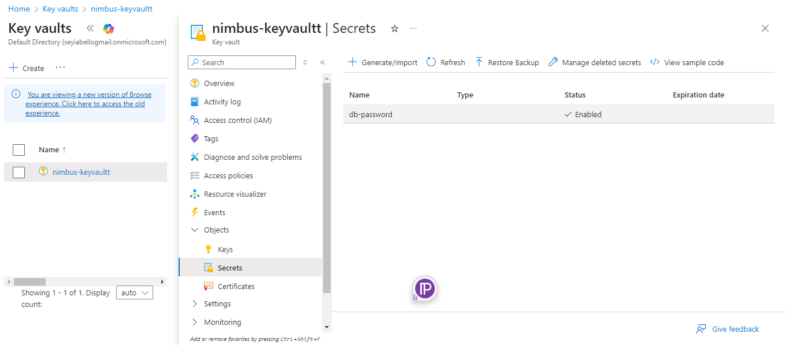
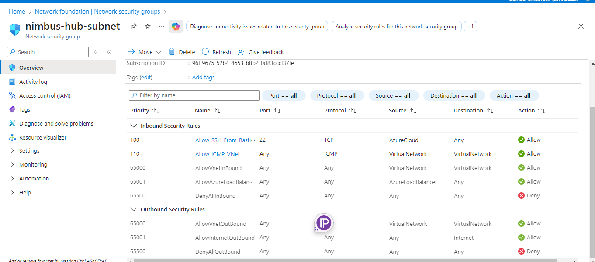
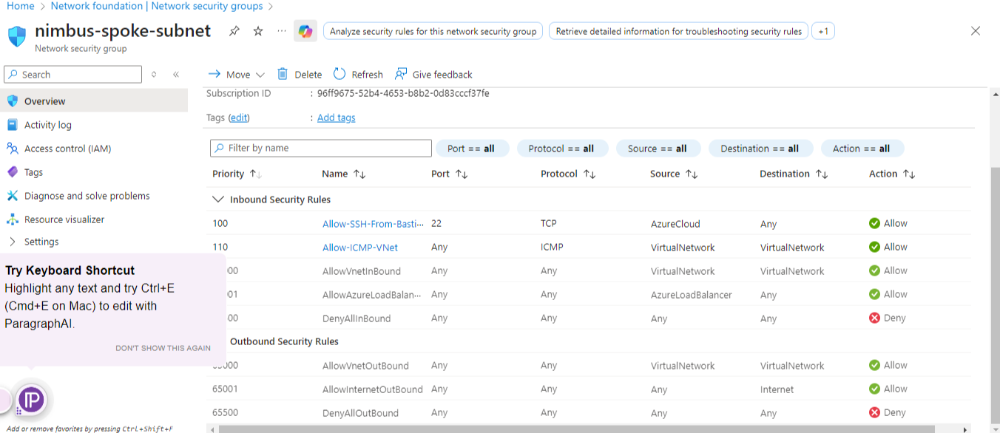
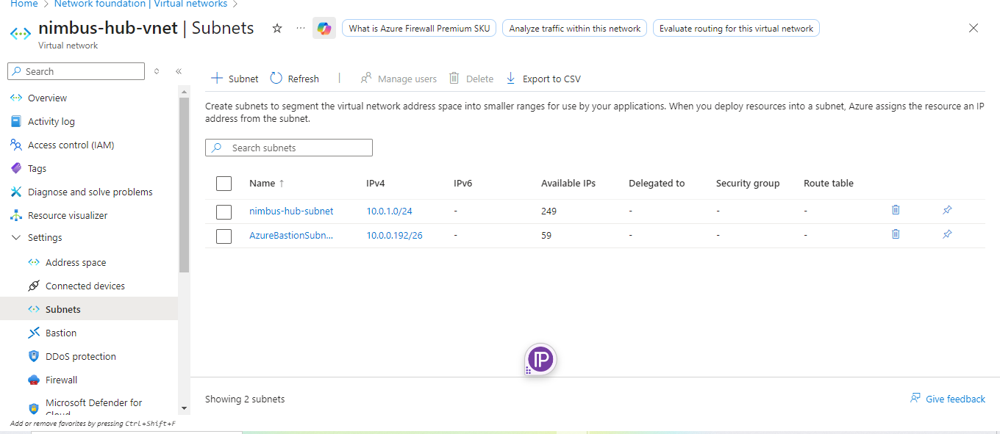
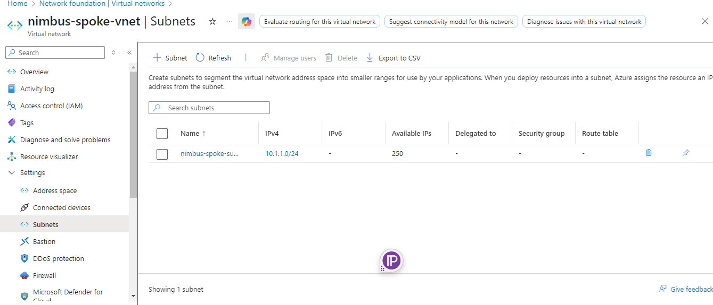
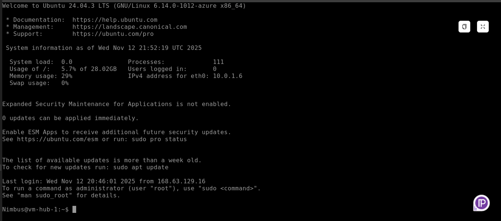

# Azure Fundamentals Capstone Project  
## Building a Secure Multi-VNet Cloud Environment on Microsoft Azure

This project demonstrates the design and deployment of a **secure multi-VNet Azure environment**, following industry best practices in cloud architecture, DevOps, and cybersecurity.  
It aligns with Microsoft’s Cloud Adoption Framework and reflects patterns used in real enterprise environments.

---

# 📌 Project Overview

The environment is built using a **Hub–Spoke network topology**, ensuring traffic isolation, centralized security controls, and clear separation of workloads.

This deployment includes:

- Hub VNet + Spoke VNet configuration  
- Secure VNet peering  
- Azure Bastion for SSH access (no public IPs)  
- Private Endpoint–only Storage Account  
- Azure Key Vault with Managed Identity  
- Hardened Network Security Groups (NSGs)  
- Linux VMs with zero public exposure  
- End-to-end private connectivity testing  

This repository contains all diagrams, evidence screenshots, and documentation for the full deployment.

---

# 🧱 Architecture Components

## 🛰 Hub VNet – `nimbus-hub-vnet`
- Subnet: `nimbus-hub-subnet`
- VMs:  
  - `vm-hub-1`  
  - `vm-hub-2`
- NSG attached
- VNet Peering to Spoke

## 🌐 Spoke VNet – `nimbus-spoke-vnet`
- Subnet: `nimbus-spoke-subnet`
- VM:  
  - `vm-spoke-1`
- NSG attached
- Hosts Storage Private Endpoint

## 🔐 Security Services
- **Azure Bastion** → SSH access without exposing port 22  
- **Azure Key Vault** → Secrets accessible only via Managed Identity  
- **NSGs** →  
  - Allow SSH *only* from Bastion  
  - Allow ICMP between VNets  
  - Deny-all catch rules  

## 📦 Storage
- Private Endpoint enabled  
- Public network access disabled  
- Blob container contains `test.txt`

---

# 🔐 Key Security Principles Implemented

### 🔒 Zero Public Exposure  
- 0 public IP addresses  
- Bastion-only entry point into VMs  
- Storage is private-only  
- Key Vault is identity-locked  

### 🛡 Least Privilege Networking  
- SSH allowed only from Azure Bastion  
- ICMP allowed only VNet-to-VNet  
- All other inbound traffic blocked  

### 🪪 Identity-Based Access  
- Managed Identity used for Key Vault  
- No secrets stored on VMs  
- No hardcoded credentials  

---

# 📁 Screenshots (Verification & Evidence)

All screenshots are stored in the main repository folder.

---

## 🔐 Key Vault – Secret Access  

---

## 🧱 Network Security Groups (NSGs)

### Hub NSG  

### Spoke NSG  

---

## 🌐 Virtual Networks & Subnets

### Hub VNet  

### Spoke VNet  

---

## 🔗 VNet Peering

### Hub → Spoke  

### Spoke → Hub  

---

## 📦 Storage Account – Private Endpoint Secured  

---

## 🧪 Connectivity Testing  

---

## 🔐 Azure Bastion Access  

---

# 📂 Repository Structure

azure-fundamentals-capstone/
│
├── Azure Fundamentals Capstone Project Seyi.PNG
├── Azure Fundamentals Capstone Project Seyi.drawio
├── Nimbus Azure Fundamentals Capstone Project.docx
├── Bastionconnectionvm1.png
├── HubNSG.png
├── KeyVaultSecrets.png
├── Nimbus-hub-vnet.png
├── Nimbus-spoke-vnet.png
├── SpokeNSG.png
├── VMsecurity.png
├── hubvnetpeerings.png
├── ping.png
├── spokevnetpeerings.png
├── testtxtincontainer.png
└── README.md

markdown
Copy code

---

# 🚀 Skills Demonstrated

### **Cloud Engineering**
- Hub–Spoke Architecture  
- Private Endpoints  
- VNet Peering  
- Secure VM Access  

### **DevOps**
- Infrastructure documentation  
- Cloud environment provisioning  
- Identity-based access control  

### **Cybersecurity**
- Zero-trust access  
- Network segmentation  
- NSG hardening  
- Managed Identity  
- Secure secret storage  

---

# 👤 Author

**Oluwaseyi Adesegun Bello**  
DevOps Engineer | MSc Human-Centred AI  
Security+ Certified | Azure | Kubernetes | Terraform  

🔗 **GitHub:** https://github.com/seyiabello  
🔗 **LinkedIn:** https://www.linkedin.com/in/oluwaseyi-bello-2653a2215/